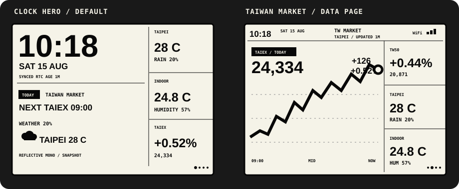

# esp32-rlcd-standalone

A 400 × 300 monochrome information display for the Waveshare
ESP32-S3-RLCD-4.2, built to run on its own: no proxy, no cloud service, no
companion app. The board joins your Wi-Fi through its own captive portal and
fetches everything itself.



## What it does

A five-page carousel — a clock-dominant Home, Taiwan and US market pages,
weather, and indoor climate — plus a Setup page and a firmware-update page that
sit outside the rotation and appear only when they have something to say.

| Source | Where the data comes from |
| --- | --- |
| Time | SNTP, falling back to the onboard PCF85063 RTC, then to compile time |
| Indoor | Onboard SHTC3 over I²C |
| Weather | Open-Meteo, located by IP geolocation |
| Taiwan index | TWSE |
| US indices | Yahoo Finance quote endpoint |
| Battery | ADC across the board's sense divider |

Home dwells 30 s, data pages 12 s; KEY and BOOT step backward and forward, and
a manual press pauses auto-rotation for 60 s.

## The rule the UI follows

**Nothing reaches the panel as a number unless it was measured or fetched.**

This is the constraint most of the display code exists to enforce, and it is
easy to undo by accident:

- A provider with no data leaves `valid` false and the page renders `NO DATA`.
- Stale is not absent — a real reading that aged shows its real values with an
  ` OLD` marker instead of being discarded.
- TWSE publishes a daily close only, so the Taiwan chart, grid and axis are
  suppressed rather than drawing a flat line through a repeated value. The
  figures would be real but the shape invented.
- An invalid tile draws no icon. A thermometer glyph asserts a reading exists.
- The clock says which source it is using — `SYNC`, `RTC`, or `FALLBACK` — so a
  compile-time fallback is never mistaken for network time.
- Auto-rotation skips pages with nothing worth dwelling on, but never removes
  them: manual navigation still reaches every page.

## Firmware updates

Two ways in, both feeding one `ota::Session` so they share the same checks:

- **Browser upload** — pick a `.bin` on the setup page.
- **URL pull** — give it an `https://` address and it downloads the image itself.

Both refuse a wrong file before erasing anything. The first 112 bytes decide:
a JPEG dies on byte one, an image for another chip dies at the chip id, a
bootloader dies at the application descriptor, and another project's firmware
dies on the project name. Erasing a 3 MiB slot to discover on the last byte
that someone picked the wrong file is a bad trade.

A freshly written image boots unconfirmed. It has ~30 s to prove the render
loop is actually turning; if it does not, the board rolls itself back and says
`UPDATE ROLLED BACK` on the panel. It cannot rely on the watchdog to do this —
see [the rollback note](#why-the-rollback-guard-watches-the-render-loop) below.

Updating requires physical access: the portal only runs in setup mode, which
is entered with a ~2 s KEY press. A board sitting on your network cannot be
reflashed from a browser without someone walking over to it.

## Hardware

ESP32-S3-WROOM-1-N16R8 — 16 MiB QIO flash, 8 MiB octal PSRAM — driving an
ST7305 reflective 400 × 300 monochrome panel. Reflective means no backlight:
contrast comes from ambient light, which is why fonts and strokes are
deliberately heavy and why a full-screen repaint is visible enough to be worth
avoiding.

| Position | Button | Behaviour |
| --- | --- | --- |
| Left | PWR | Short press powers on, long press powers off |
| Middle | KEY (GPIO18) | Short = previous page, long ~2 s = enter/exit setup |
| Right | BOOT (GPIO0) | Short = next page; held during power-on = ROM downloader |

The official docs give these functions but not their positions. To identify
them on another unit, press each while watching serial: KEY and BOOT log
`ui_app: button event=`, and PWR logs nothing because it is not an application
GPIO.

## Building

ESP-IDF 5.5.2 and LVGL 9.3.0, both pinned project-locally.

```bash
./scripts/bootstrap-idf.sh          # one-time, installs into .tools/
./scripts/idf.sh build

cmake -S tests/host -B build-host   # pure logic, no hardware needed
cmake --build build-host --parallel
./build-host/host_tests
```

To flash, resolve the port by MAC rather than trusting a port number — names
like `/dev/cu.usbmodem1101` are handed out in enumeration order, so another USB
serial device can take the one you meant:

```bash
RLCD_BOARD_MAC=aa:bb:cc:dd:ee:ff    # yours; read it with esptool read_mac
PORT="$(./scripts/find-board-port.sh)"
./scripts/idf.sh -p "$PORT" app-flash
```

## Before you flash anything

Take a full backup first. `firmware/backups/` is gitignored because a whole-
flash dump contains the NVS partition, and that holds your Wi-Fi credentials —
do not commit one or paste it anywhere.

```bash
python3 .agents/skills/esp32-s3-rlcd-dev/scripts/backup_factory_flash.py \
  firmware/backups/factory-full-flash-$(date +%F).bin --port "$PORT"
```

**Never burn eFuses on this board.** No Secure Boot, no flash encryption, no
`espefuse burn-*`. This is the one line between recoverable and bricked: the
ROM bootloader is in silicon and the board uses native USB Serial/JTAG, so a
corrupt partition table, a half-written app, or entirely blank flash all still
enumerate and still accept esptool. Burning `DIS_DOWNLOAD_MODE` or
`DIS_USB_SERIAL_JTAG` closes that permanently and nothing undoes it.
`espefuse summary` is read-only and safe.

Recovery ladder, cheapest first:

1. `otadata` corrupt → the bootloader falls back to `factory` unaided.
2. App broken, USB enumerating → reflash from the host.
3. USB not enumerating → PWR off, then PWR on while holding BOOT ~1 s.
4. Everything else → restore a full verified backup from `0x0`.

## Layout

```text
components/app_core       pure snapshot, page registry, carousel, battery math
components/board_rlcd     display, LVGL port, buttons, shared I2C, SHTC3, ADC
components/ui             all rendering; knows nothing about networks
components/wifi_config    pure credential/QR/passphrase logic, host-tested
components/wifi_provision esp_wifi, NVS, captive portal; owns the AppSnapshot
components/ota            image validation, update session, rollback guard
components/net_time       SNTP
components/weather        IP geolocation + Open-Meteo
components/market         TWSE + Yahoo
components/net_log        log streaming over TCP, off by default
```

Two rules hold this together, both learned the hard way:

**One publisher.** `wifi_provision` owns the single `AppSnapshot` behind a
mutex and is the only caller of `ui::publish_snapshot()`. Provider tasks call
its setters. A second owner would race it.

**No `lv_*` outside the LVGL thread.** Providers publish; a 100 ms timer
applies. A publish that does not change page identity updates only the labels
whose text actually differs, because `lv_label_set_text` reallocates and
invalidates even for an identical string. With several providers on their own
timers this is load-bearing: an unconditional rebuild on publish cost a
watchdog lockup once.

### Why the rollback guard watches the render loop

`CONFIG_ESP_TASK_WDT_PANIC` is off here, so a hung LVGL task logs every five
seconds forever and never resets — and an image that never resets is never
rolled back by the bootloader either. A bad update would simply own the board.
So the guard takes its own evidence instead: a monotonic count of completed
`lv_timer_handler` passes, sampled across a window. Alive means confirm the
image; no movement means roll back and reboot deliberately.

## Traps this board has already sprung

- `sdkconfig.defaults` applies only when `sdkconfig` is first generated. Adding
  an option to an existing project does nothing and the build still succeeds —
  `CONFIG_LV_USE_QRCODE` was silently off while a QR feature "shipped". Delete
  `sdkconfig`, rebuild, and diff to confirm the value landed.
- `version.txt` is read only at CMake configure time. An existing `build/`
  keeps the old version through a successful build and a verified flash.
- Never build or flash while `partitions.csv` may be mid-edit. `app-flash`
  writes the app at whatever offset the current CSV declares while the device
  keeps the table it was last given.
- `LV_ASSERT_MSG` calls LVGL's assert handler, whose default body is an
  infinite loop. With `LV_USE_LOG` off, one out-of-bounds object hangs the LVGL
  task forever and the only symptom is a watchdog every five seconds. Geometry
  checks here log and continue.
- `esp_wifi_connect()` while still associated returns `ESP_ERR_WIFI_CONN` and
  silently ignores the new config. Disconnect first.
- ESP-IDF puts the query string in `req->uri`, so logging it would leak the
  setup page password.
- Anything that can fail at runtime and fall back silently needs a log line
  saying which branch it took.

More in [`.agents/skills/esp32-s3-rlcd-dev/SKILL.md`](.agents/skills/esp32-s3-rlcd-dev/SKILL.md),
design notes in [`docs/design/`](docs/design), and the physical acceptance
record in [`docs/hardware/first-layout-checklist.md`](docs/hardware/first-layout-checklist.md).

## Status

The firmware runs standalone with all four data sources live. What has not been
confirmed on physical hardware is tracked in the acceptance checklist above and
should not be assumed working — notably the ROM-downloader path after the OTA
partition migration, the update flow end to end from a phone, and battery
calibration (`CONFIG_BATTERY_CALIBRATION_PERMILLE` is still at its untrimmed
default, so the overvoltage thresholds do not yet mean anything).

## Licence

GPL-3.0-or-later. See [LICENSE](LICENSE).

`firmware/upstream/` holds a copy of Waveshare's own factory image, fetched
from their public repository and recorded with its source URL and SHA-256 in
the accompanying `.json`. It is their work, not covered by this project's
licence, and is kept only so the board can be restored to how it shipped.
